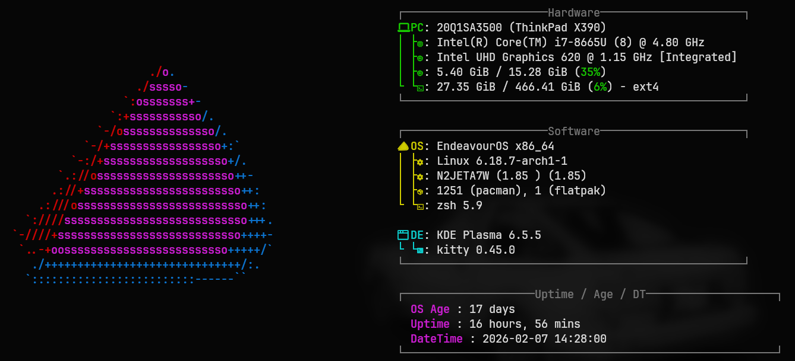

#  Dotfiles

> My personal configuration files for Arch Linux (EndeavourOS). 
> Managed with **GNU Stow**.

## Preview
<h1 align="center">My EndeavourOS Linux Setup</h1>

<p align="center">
  
</p>

## Tech Stack
* **OS:** Arch Linux (EndeavourOS)
* **Shell:** Zsh
* **Terminal:** [Kitty](https://sw.kovidgoyal.net/kitty/)
* **Prompt:** [Starship](https://starship.rs/)
* **Font:** JetBrains Mono Nerd Font


## Install.sh Installation
```bash
sh -c "$(curl -fsSL https://raw.githubusercontent.com/project-lbr/dotfiles/main/install.sh)"
```

## Installation
### 1. Dependencies
First, install the necessary packages:
```bash
sudo pacman -S kitty starship zsh stow git ttf-jetbrains-mono-nerd
```
