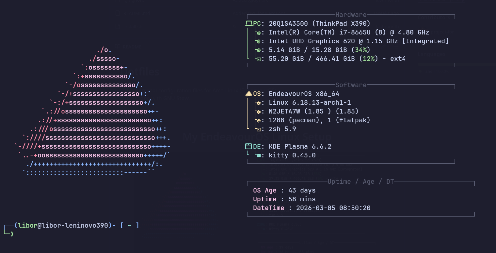

# ❄️ Dotfiles

> Personal configuration files for Arch-based Linux distributions (optimized for EndeavourOS).
> Managed with ❤️ using **GNU Stow**.

<p align="center">
  
</p>

---

## 🚀 Quick Start (Automated Installation)

> [!WARNING]
> **Compatibility Warning:** These scripts are designed for Arch Linux and EndeavourOS. They are **not compatible** with CachyOS.

You can set up your environment using two separate scripts:

### 1. Install Applications
This script updates your system, installs `yay` if missing, and installs all required packages (browsers, media players, editors, terminal utilities):

```bash
bash -c "$(curl -fsSL https://raw.githubusercontent.com/project-lbr/dotfiles/main/installs/install_apps.sh)"
```

### 2. Setup Dotfiles & GNU Stow
This script clones/updates the repository, sets up Zsh (with Oh My Zsh, auto-suggestions, syntax highlighting), backs up your existing configurations (renames them to `.bak`), links the configurations using GNU Stow, and sets your default shell to Zsh:

```bash
bash -c "$(curl -fsSL https://raw.githubusercontent.com/project-lbr/dotfiles/main/installs/setup_dotfiles.sh)"
```

---

## 🛠️ Manual Installation & Dependencies

If you prefer to configure things manually or want to pick only specific configs:

### 1. Install Core Dependencies
Make sure you have the core packages installed:
```bash
sudo pacman -S kitty starship zsh stow git ttf-jetbrains-mono-nerd
```

### 2. Clone the Repository
Clone the repository to your home directory:
```bash
git clone https://github.com/project-lbr/dotfiles.git ~/dotfiles
cd ~/dotfiles
```

### 3. Deploy Configs with Stow
Use GNU Stow to symlink the configurations:
```bash
stow btop fastfetch kitty lazygit starship yazi zshrc
```

---

## 📦 What's Inside

This repository contains configurations for:

* **[Kitty](file:///home/libor/dotfiles/kitty)** - Fast, GPU-accelerated terminal emulator.
* **[Starship](file:///home/libor/dotfiles/starship)** - Blazing-fast, minimal, and customizable prompt.
* **[Zsh](file:///home/libor/dotfiles/zshrc)** - Configured with Oh My Zsh, autocomplete, and syntax highlighting.
* **[Fastfetch](file:///home/libor/dotfiles/fastfetch)** - Elegant, fast system information display.
* **[Yazi](file:///home/libor/dotfiles/yazi)** - Terminal file manager.
* **[Btop](file:///home/libor/dotfiles/btop)** - Interactive system resources monitor.
* **[Lazygit](file:///home/libor/dotfiles/lazygit)** - Simple terminal UI for git.

---

## 🔗 Useful Links & Addons
External add-ons used in this setup:
* [Kara](https://github.com/dhruv8sh/kara) - KDE Window Decoration theme.
* [Plasma 6 Window Title Applet](https://github.com/dhruv8sh/plasma6-window-title-applet) - Plasma 6 widget for displaying the active window title in the panel.
